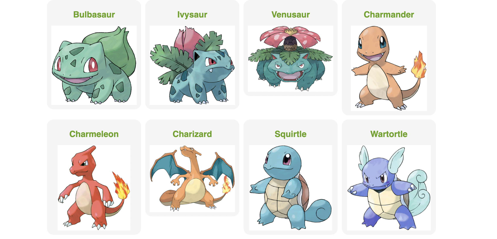

# Flareact Pokemon App

Flareact pokemon example app buit with...

- [Flareact](https://flareact.com/) – Flareact is an edge-rendered React framework built for Cloudflare Workers...
- [Styled Components](https://styled-components.com/) – Visual primitives for the component age...
- [Cloudflare Workers](https://workers.cloudflare.com/) -Deploy serverless code instantly across the globe...

## Quick Overview

---

```sh
git clone https://github.com/hamidihekmat/Flareact-Pokemon
cd Flareact-Pokemon
yarn install
yarn dev
# or
yarn deploy
```

# Example



Deploy it to the Cloudflare [view demo](https://pokemon.demonish.workers.dev/)

# Overview

This app was taken from [NextJS 12.1 SSR & SSG: Everything you need to know](youtube.com/watch?v=kdXKz1UWc3E) by [Jack Herrington](https://www.youtube.com/channel/UC6vRUjYqDuoUsYsku86Lrsw) and migrated to Flareact Edge Render

### Make Sure to subscribe to his channel!
